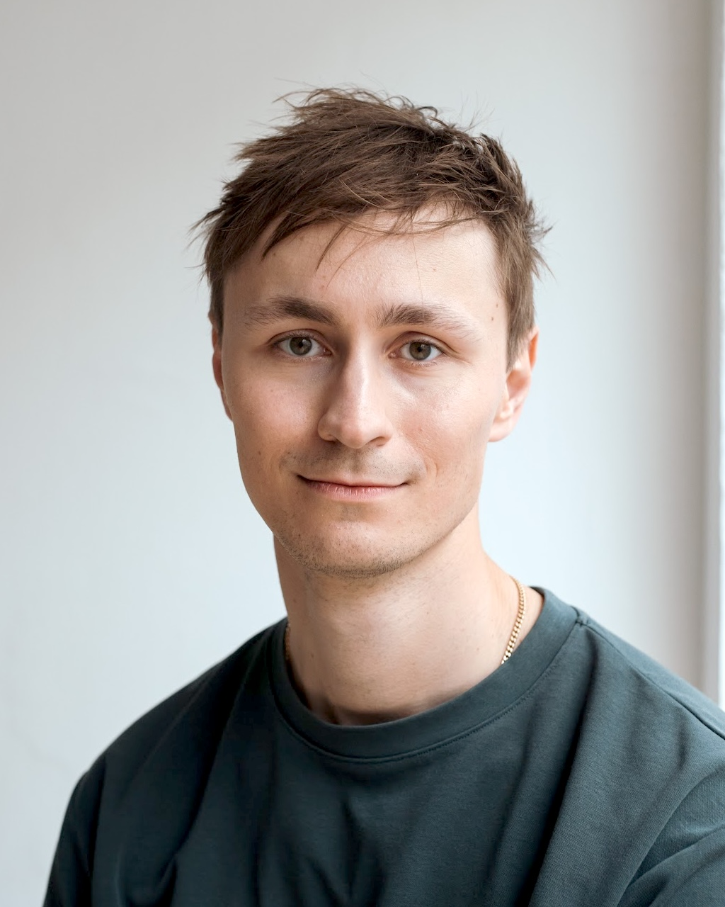

# at a glance
<section id="about-sec" class="wg-about-biography">
    

    

        
        <h3 id="about-head">Frederik Bennhoff</h3>
        
PhD Candidate in Economics

        
University of Zürich

        

        <a href="mailto:frederik.bennhoff@econ.uzh.ch" target="_blank">
            <i class="fas fa-envelope" style="color: black; transition: transform 0.2s;" onmouseover="this.style.transform='scale(0.9)'; this.style.color='red';" onmouseout="this.style.transform='scale(1)'; this.style.color='black';"></i></a>
        
        <a href="https://github.com/FredHB"><i class="fab fa-github-square" style="color: black; transition: transform 0.2s;" onmouseover="this.style.transform='scale(0.9)'; this.style.color='red';" onmouseout="this.style.transform='scale(1)';  this.style.color='black';"></i></a>
        <a href="https://www.linkedin.com/in/f-h-bennhoff/"><i class="fab fa-linkedin" style="color: black; transition: transform 0.2s;" onmouseover="this.style.transform='scale(0.9)'; this.style.color='red';" onmouseout="this.style.transform='scale(1)';  this.style.color='black';"></i></a>
        

    

    

    <!-- <h2> news </h2> -->
    

    I am a PhD candidate in Economics at the <b>University of Zurich</b> (UZH) and I hold a MPhil in Economic Research from the <b>University of Cambridge</b>. In Fall 2024, I have been a visiting PhD at the <b>London School of Economics</b> (host: Johannes Spinnewijn), and I am currently on a research visit at <b>De Nederlandsche Bank</b> (DNB). I will visit <b>Paris School of Economics</b> in Spring 2026 (host: Gabriel Zucman). My supervisors at UZH are Florian Scheuer and Felix Kübler.

    I work on two strands of research: First, bringing together fields of public finance and traditional finance, and second, understanding firms in the macro-economy. I will be on the job market in 2026. 
    

    <small>---- updated in June 2025</small>
    

</section>

<h2>research summary</h2>

I spend half of my time working on novel ways to understand the <strong>wealth and tax implications of capital gains</strong>. Understanding how households build wealth through investment, and how these investments are shaped by tax policy, has strong implications on how extreme wealth and poverty persists across generations. In my job market paper (w.i.p.), I show how asset choices are distorted by capital gains taxation systems, and how having access to sufficiently rich capital markets allows undermining capital gains taxation. In a related project with Florian Scheuer we are modeling how the practice of forgiving capital gains taxes at the time of death of the original owner affects portfolio choices, and renders capital gains taxes regressive. We show how some (widely discussed) changes in the tax code can undo regressivity, without provoking strong behavioral responses. Finally, jointly with Lorenzo Ranaldi, Moritz Kuhn and Florian Scheuer, we examine the Dutch Household Survey. Our goal is to elicit the mechanisms through which households gain from investments.

I use the other half to examine the <strong>link between firm behavior and aggregate output</strong>. Igli Bajo, Alessandro Ferrari and I are shedding light on theoretical and empirical underpinnings of macroeconomic cleansing effects. We research under what conditions firm exit induced by a crisis can improve long-run productivity. Additionally, together with Timo Haber and Niklas Schmitz, I am uncovering firm-level reactions to shocks. We show that left-skewed responses to shocks are driven by the reactions of large firms, and prove a tight theoretical relationship between such skewness and firm market power.

During 2019-2021 I was an economist (pre-doctoral fellow) at the <em>Center for the Economics of Human Development</em> at <strong>University of Chicago</strong> for Prof. James J. Heckman. My research from this period was mainly focused on labor economics and the evaluation of social programs.

<!-- Include Font Awesome for icons -->
<link rel="stylesheet" href="https://cdnjs.cloudflare.com/ajax/libs/font-awesome/5.15.4/css/all.min.css">

<!--
- **Email:** [frederik.bennhoff@econ.uzh.ch](mailto:frederik.bennhoff@econ.uzh.ch)  
    
    ---

    ## **Research Interests**

    - Macroeconomics
    - Macro-Finance
    - Public Economics
    - Capital Gains Taxation
    - Monetary and Fiscal Interactions

    ---
-->